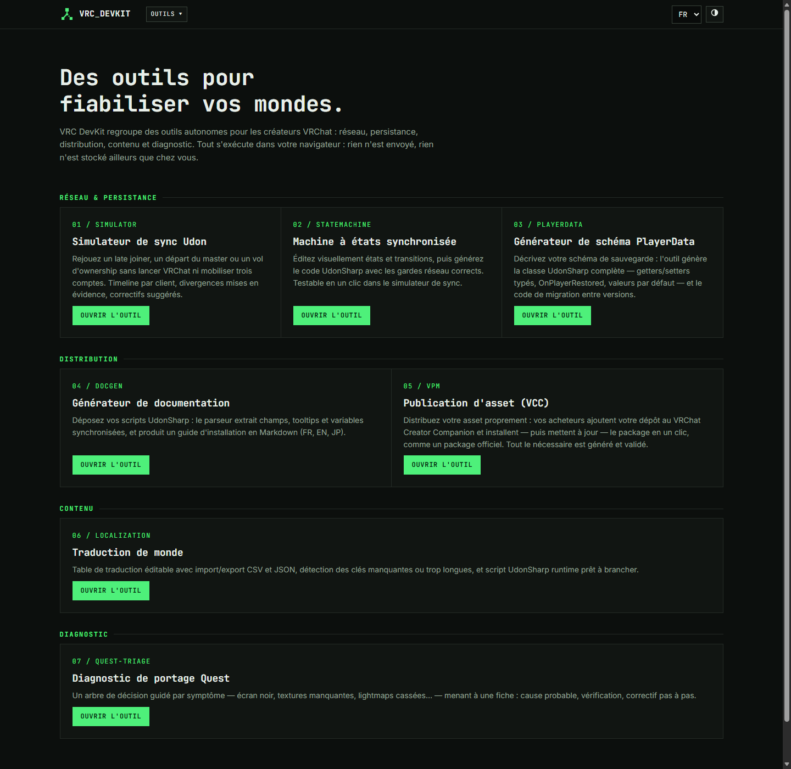
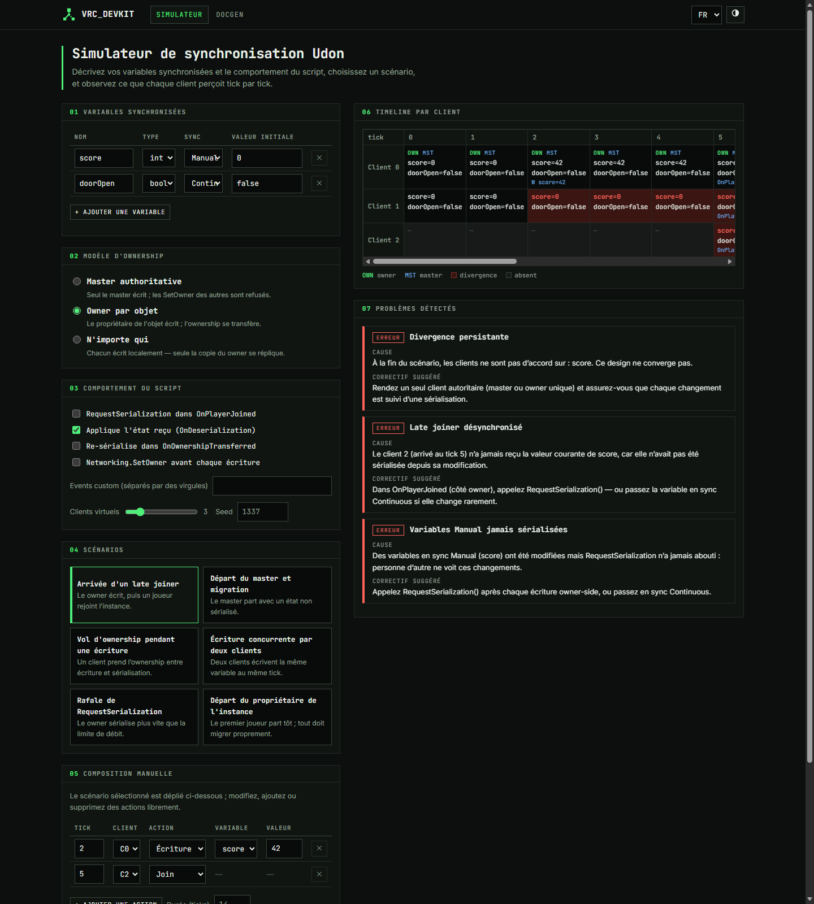
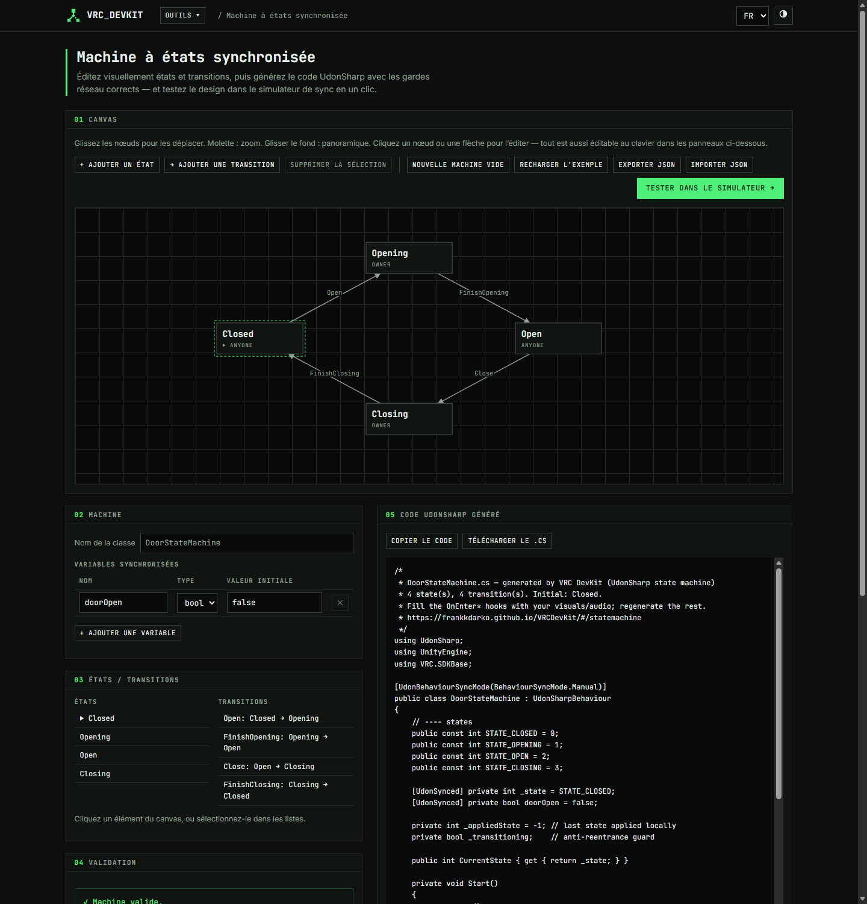
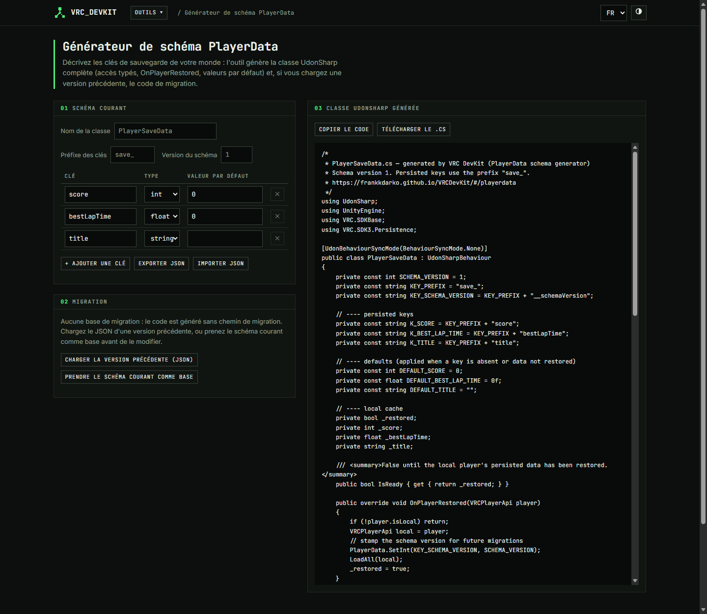
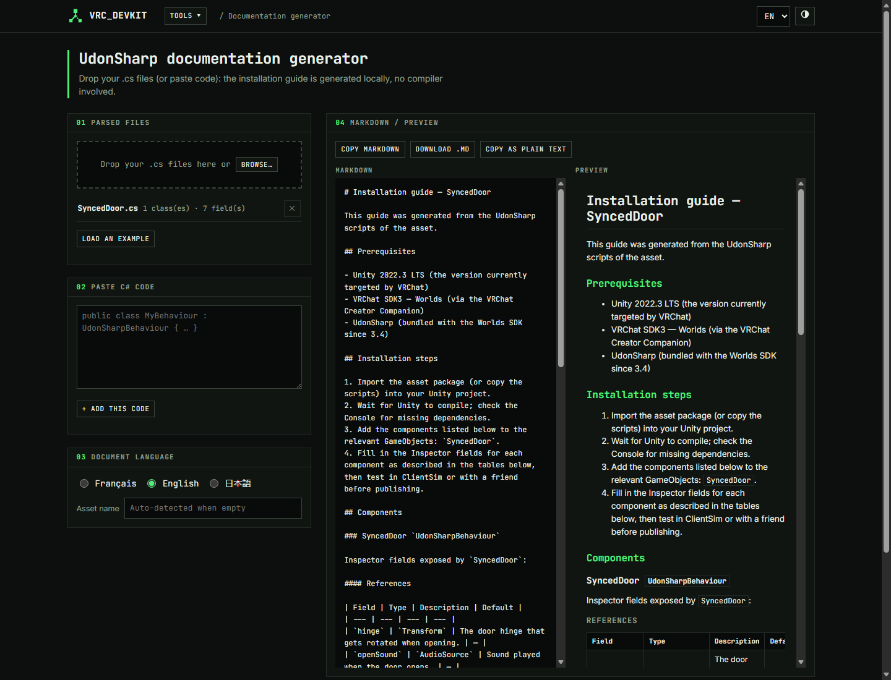
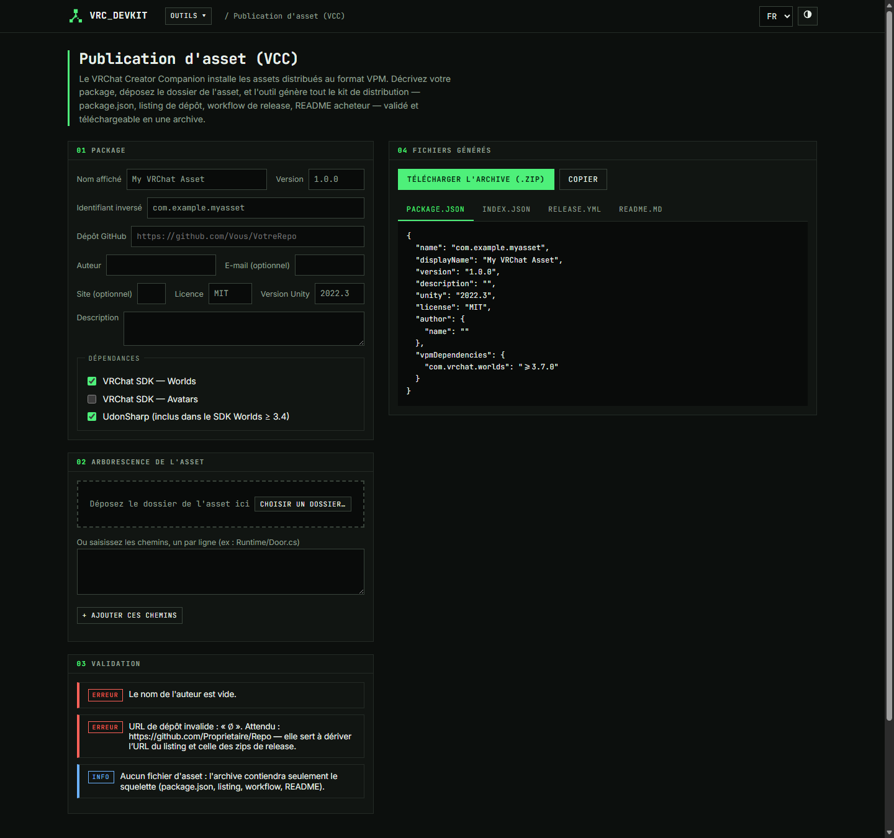
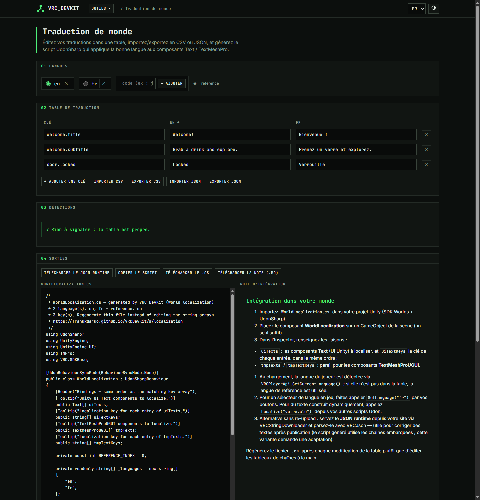
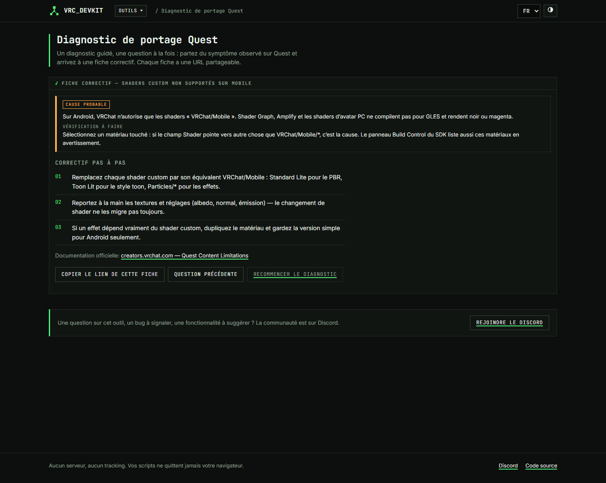

# VRC DevKit

**[🇫🇷 Version française ci-dessous](#-français)**

> Seven client-side tools for VRChat world creators — no server, no tracking,
> nothing leaves your browser.
>
> **Live demo: <https://frankkdarko.github.io/VRCDevKit/>**



## Network & persistence

### 01 — Udon sync simulator (`#/simulator`)

Test an UdonSharp network design without launching VRChat or juggling three
accounts. Describe your synced variables (Manual/Continuous), the ownership
model and the script behavior; replay predefined scenarios — late joiner,
master leave, ownership steal, concurrent writes, RequestSerialization burst —
or compose your own action list tick by tick. The per-client timeline
highlights divergences, and every detected problem comes with a severity, a
one-sentence cause and a suggested fix. Deterministic, seedable engine; the
whole state lives in the URL (compressed JSON) for sharing, plus JSON
export/import.



### 02 — Synced state machine (`#/statemachine`)

Visually edit states and transitions on a canvas (drag, zoom, pan) — or
entirely from the keyboard-accessible panels. Each state declares who may
trigger its transitions (master / owner / anyone) and which synced variables
are written on entry; transitions carry optional C# conditions. The generated
UdonSharp class ships the correct network guards: authority checks,
ownership grab before synced writes, anti-reentrance flag,
RequestSerialization at the right spot, OnDeserialization for late joiners.
**Test in the simulator** converts the machine into the simulator's own share
format and opens it prefilled.



### 03 — PlayerData schema generator (`#/playerdata`)

Describe your save schema (keys, types, defaults, schema version): the tool
generates the full UdonSharp class — typed accessors, OnPlayerRestored with a
not-yet-loaded state, defaults for absent keys, arrays persisted as JSON via
VRCJson. Load a previous schema version (or snapshot the current one) and
edit it: renames, retypes, additions and removals are tracked by row identity
and compiled into a `MigrateFromVn()` method, with explicit warnings for
lossy and non-migratable conversions. Schemas export/import as JSON.



## Distribution

### 04 — UdonSharp documentation generator (`#/docgen`)

Drop (or paste) your `.cs` scripts: a client-side, compiler-free parser
extracts classes, `public` / `[SerializeField]` fields, `[Tooltip]`,
`[Header]`, `[Range]`, `[UdonSynced]`, types and defaults — and generates an
installation guide in Markdown with a live HTML preview. Output language
selectable independently from the UI (**FR / EN / JP**); copy, download, or
copy as plain text. Unparsable files warn without breaking anything.



### 05 — Asset publishing via VCC/VPM (`#/vpm`)

Name, reverse-domain id, version, author, dependencies (Worlds / Avatars /
UdonSharp) and your asset folder (dropped or typed): the tool validates
everything — id format, semver, dependency coherence — and produces a VPM
`package.json`, the repository listing `index.json`, a GitHub Actions
workflow (zip + sha256 attached on `v*` tags, listing deployed to Pages) and
a bilingual buyer README with the VCC deep link. All bundled in one starter
archive, zipped in the browser by a dependency-free ZIP writer.



## Content

### 06 — World localization (`#/localization`)

An editable translation table — one key column, one column per language —
with CSV **and** JSON import/export (comma and semicolon dialects handled).
Automatic detections: empty or duplicate keys, orphan keys, missing
translations, and texts long enough to risk UI overflow. Outputs: a runtime
JSON data file, a generated `WorldLocalization.cs` that resolves the player's
language via `VRCPlayerApi.GetCurrentLanguage()` and applies strings to
referenced Text / TextMeshProUGUI components, and an integration note.



## Diagnostics

### 07 — Quest porting diagnostics (`#/quest-triage`)

A guided decision tree, one question at a time, starting from the symptom:
black world, missing textures, size limit, broken lightmaps, PC/Android
differences. Every path ends on a fix sheet — probable cause, check to run,
step-by-step fix — with a shareable URL. The whole tree lives in a single
data file (`src/data/questTriage.ts`, inline FR/EN strings) so it can be
enriched without touching code; integrity is enforced by tests.



## Tech notes

- Vite + React + TypeScript, deployed to GitHub Pages (branch `gh-pages`) by
  [`.github/workflows/deploy.yml`](.github/workflows/deploy.yml).
- Hash routing (`#/simulator`, `#/statemachine`, …) — no 404s on GitHub Pages.
- Zero runtime CDN dependency, zero network call, fonts self-hosted, zero
  external library for the canvas, the CSV codec or the ZIP writer.
- UI in French/English: auto-detected from `navigator.language`, switchable,
  persisted, overridable with `?lang=fr|en`. Dark theme by default.
- All business logic (simulation engine, C# parser, code generators, schema
  diff, CSV/ZIP codecs, decision tree) is pure TypeScript isolated from
  React, covered by **94 Vitest tests**: `npm test`.

```bash
npm install
npm run dev       # local dev server
npm test          # unit tests
npm run build     # production build in dist/
```

To regenerate the bitmap assets (favicon, Open Graph image):
`npm i --no-save sharp && node scripts/generate-assets.mjs`.

Questions, bugs, ideas? Join the community on
[Discord](https://discord.gg/t33r3Wfj3n).

License: [MIT](LICENSE).

---

# 🇫🇷 Français

> Sept outils 100 % côté client pour créateurs de mondes VRChat — sans
> serveur, sans tracking, rien ne quitte votre navigateur.
>
> **Démo : <https://frankkdarko.github.io/VRCDevKit/>**

## Réseau & persistance

### 01 — Simulateur de synchronisation Udon (`#/simulator`)

Testez un design réseau UdonSharp sans lancer VRChat ni mobiliser trois
comptes. Décrivez vos variables synchronisées (Manual/Continuous), le modèle
d'ownership et le comportement du script ; rejouez les scénarios prédéfinis —
late joiner, départ du master, vol d'ownership, écritures concurrentes,
rafale de RequestSerialization — ou composez vos actions tick par tick. La
timeline par client met les divergences en évidence, et chaque problème
détecté vient avec sévérité, cause en une phrase et correctif suggéré.
Moteur déterministe et seedable ; l'état complet tient dans l'URL (JSON
compressé) pour le partage, plus export/import JSON.

### 02 — Machine à états synchronisée (`#/statemachine`)

Éditez visuellement états et transitions sur un canvas (glisser, zoom,
panoramique) — ou entièrement au clavier via les panneaux. Chaque état
déclare qui peut déclencher ses transitions (master / owner / tous) et les
variables synchronisées écrites à l'entrée ; les transitions portent des
conditions C# optionnelles. Le code UdonSharp généré embarque les bonnes
gardes réseau : autorité, prise d'ownership avant écriture, drapeau
anti-réentrance, RequestSerialization au bon endroit, OnDeserialization pour
les late joiners. **Tester dans le simulateur** convertit la machine dans le
format de partage du simulateur et l'ouvre pré-rempli.

### 03 — Générateur de schéma PlayerData (`#/playerdata`)

Décrivez votre schéma de sauvegarde (clés, types, défauts, version) : l'outil
génère la classe UdonSharp complète — accès typés, OnPlayerRestored avec état
« pas encore chargé », défauts pour les clés absentes, tableaux persistés en
JSON via VRCJson. Chargez une version précédente (ou prenez le schéma courant
comme base) puis modifiez : renommages, changements de type, ajouts et
suppressions sont suivis par identité de ligne et compilés en une méthode
`MigrateFromVn()`, avec avertissements explicites pour les conversions avec
perte ou non migrables. Schémas exportables/importables en JSON.

## Distribution

### 04 — Générateur de documentation UdonSharp (`#/docgen`)

Déposez (ou collez) vos scripts `.cs` : un parseur côté client, sans
compilateur, extrait classes, champs `public` / `[SerializeField]`,
`[Tooltip]`, `[Header]`, `[Range]`, `[UdonSynced]`, types et valeurs par
défaut — et génère un guide d'installation en Markdown avec aperçu HTML.
Langue du document indépendante de l'UI (**FR / EN / JP**) ; copie,
téléchargement, texte brut. Un fichier non parsable avertit sans rien casser.

### 05 — Publication d'asset via le VCC (`#/vpm`)

Nom, identifiant inversé, version, auteur, dépendances (Worlds / Avatars /
UdonSharp) et votre dossier d'asset (déposé ou saisi) : l'outil valide tout —
format d'identifiant, semver, cohérence des dépendances — et produit le
`package.json` VPM, le listing `index.json` du dépôt, un workflow GitHub
Actions (zip + sha256 attachés aux tags `v*`, listing déployé sur Pages) et
un README acheteur bilingue avec le lien profond VCC. Le tout regroupé dans
une archive de démarrage, zippée dans le navigateur par un écrivain ZIP sans
dépendance.

## Contenu

### 06 — Traduction de monde (`#/localization`)

Une table de traduction éditable — une colonne clé, une colonne par langue —
avec import/export CSV **et** JSON (virgule et point-virgule gérés).
Détections automatiques : clés vides ou en double, clés orphelines,
traductions manquantes, textes assez longs pour risquer un débordement d'UI.
Sorties : un fichier JSON runtime, un `WorldLocalization.cs` généré qui
résout la langue du joueur via `VRCPlayerApi.GetCurrentLanguage()` et
applique les chaînes aux composants Text / TextMeshProUGUI référencés, et une
note d'intégration.

## Diagnostic

### 07 — Diagnostic de portage Quest (`#/quest-triage`)

Un arbre de décision guidé, une question à la fois, à partir du symptôme :
monde noir, textures manquantes, limite de taille, lightmaps cassées,
différences PC/Android. Chaque chemin aboutit à une fiche correctif — cause
probable, vérification à faire, correctif pas à pas — avec URL partageable.
Tout l'arbre vit dans un fichier de données unique
(`src/data/questTriage.ts`, chaînes FR/EN inline) enrichissable sans toucher
au code ; son intégrité est garantie par les tests.

## Notes techniques

- Vite + React + TypeScript, déployé sur GitHub Pages (branche `gh-pages`)
  par [`.github/workflows/deploy.yml`](.github/workflows/deploy.yml).
- Routing en hash (`#/simulator`, `#/statemachine`, …) — pas de 404 sur
  GitHub Pages.
- Zéro dépendance CDN à l'exécution, zéro appel réseau, polices embarquées,
  zéro bibliothèque externe pour le canvas, le codec CSV ou l'écrivain ZIP.
- UI FR/EN : détection via `navigator.language`, sélecteur persisté,
  surcharge par `?lang=fr|en`. Thème sombre par défaut, bascule clair.
- Toute la logique métier (moteur de simulation, parseur C#, générateurs de
  code, diff de schéma, codecs CSV/ZIP, arbre de décision) est du TypeScript
  pur isolé de React, couvert par **94 tests Vitest** : `npm test`.

Questions, bugs, idées ? Rejoignez la communauté sur
[Discord](https://discord.gg/t33r3Wfj3n).

Licence : [MIT](LICENSE).
